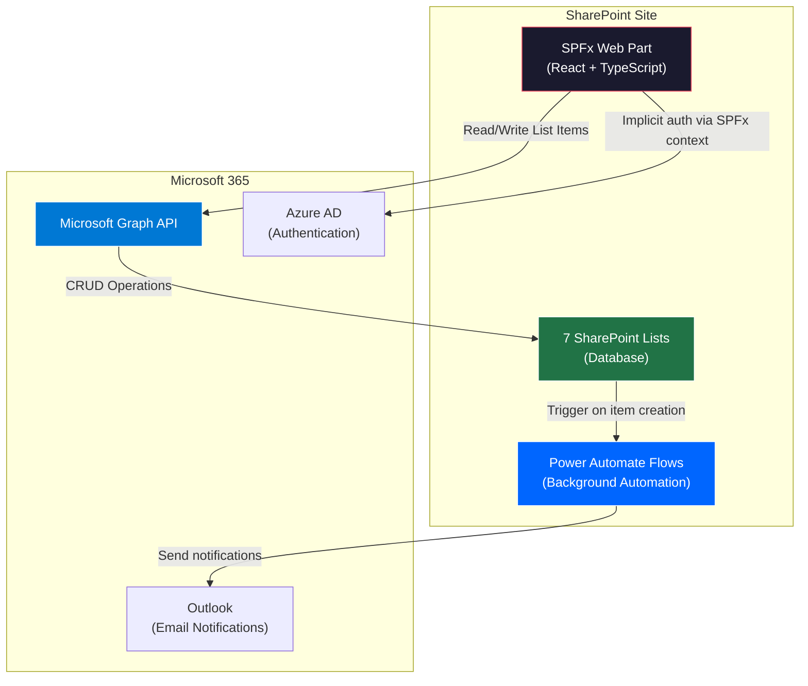
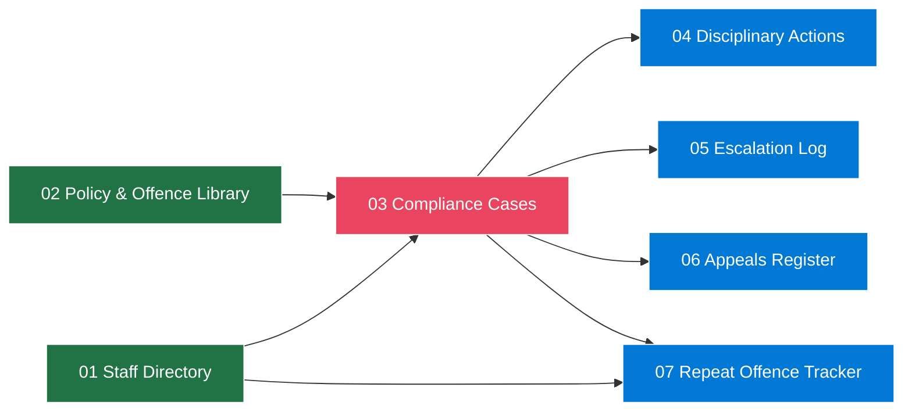
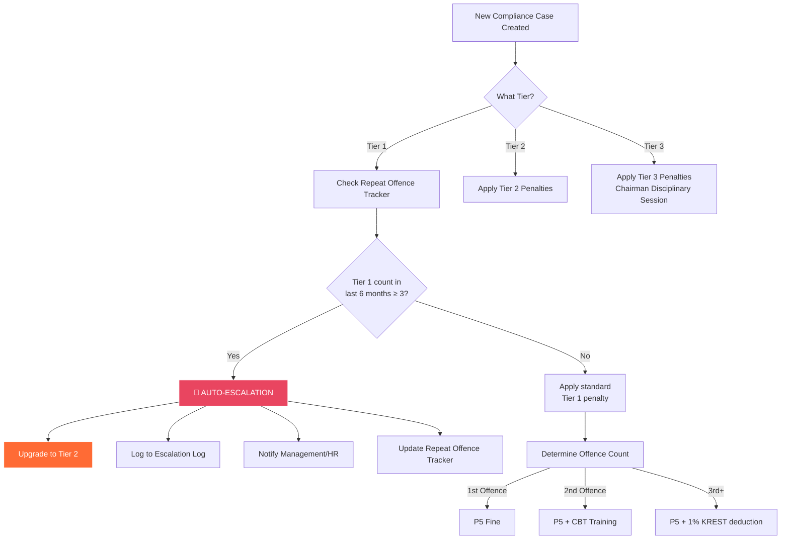

# PACT — Compliance Governance Platform
## Implementation Plan

> **Organization**: KCC / Konstructum Group  
> **SharePoint Site**: `netorgft13110820.sharepoint.com/sites/KONSTRUCTUM`  
> **Target**: SharePoint-hosted SPFx web application with Microsoft native APIs

---

## Background & Problem

KCC currently manages employee compliance penalties through a set of 7 SharePoint Lists + Power Automate flows + a Power Apps form. The goal is to build a **professional, full-featured web application** that:

1. Replaces the Power Apps form with a premium, purpose-built UI
2. Reads/writes all data to the existing 7 SharePoint Lists via **Microsoft Graph API**
3. Implements the **3-strike Tier escalation** engine (3× Tier 1 offences in 6 months → auto-upgrade to Tier 2)
4. Deploys directly to SharePoint as an **SPFx (SharePoint Framework) web part**
5. Provides an executive dashboard with compliance analytics

---

## Clarifying Questions Before Build

> [!IMPORTANT]
> I need answers to these before starting the build. Please respond to each:

### 1. SharePoint Access & Authentication
- **Do you have an Azure AD App Registration** already set up for this project, or should I build the app to use the **SPFx context** (which inherits the logged-in user's permissions automatically)?
- **Recommended**: SPFx context — zero extra auth setup, the app runs inside SharePoint and uses the current user's token.

### 2. Existing Lists — Already Created?
- Your document references all 7 lists. **Are all 7 lists already created** on your SharePoint site with the columns as documented? Or do some still need to be created?
- If they exist, I'll build the app to connect to them directly. If not, I can generate a PowerShell provisioning script to create them.

### 3. Power Automate Flows — Keep or Replace?
- You have existing Power Automate flows for notifications, escalation, and disciplinary action creation. Do you want to:
  - **Option A**: Keep Power Automate flows — the app just creates/reads list items and lets the flows handle background automation
  - **Option B**: Replace flows — the app handles escalation logic, email notifications, and disciplinary action creation all within the SPFx app via Graph API
  - **Recommended**: **Option A** for Phase 1 (less risk, your flows already work), then migrate to Option B later if needed.

### 4. User Roles
- Who should have access to **log incidents**? (Admin officers / Dept heads only?)
- Who should have **read-only dashboard** access? (Executive management?)
- Should employees see their **own** cases? (Self-service portal?)

### 5. The `ChargedPersaon` Typo
- Your doc notes the internal SharePoint column name is `ChargedPersaon` (typo). I'll use this exact internal name in all Graph API calls. **Confirmed?**

### 6. Power BI Dashboard
- Do you want the analytics dashboard **inside the SPFx app** (built with Chart.js/Recharts), or do you want to keep it as a separate **Power BI report** embedded in SharePoint?
- **Recommended**: Built-in dashboard within the app for a seamless experience, with export to Power BI as a later enhancement.

---

## Proposed Architecture



### Technology Stack (100% Microsoft Native)

| Layer | Technology | Purpose |
|-------|-----------|---------|
| **Framework** | SPFx (SharePoint Framework) | Hosts the app inside SharePoint |
| **UI** | React + TypeScript | Component-based premium UI |
| **Styling** | Fluent UI v9 + Custom CSS | Microsoft design system + custom theming |
| **Data** | Microsoft Graph API | CRUD on SharePoint Lists |
| **Auth** | SPFx Context (AadHttpClient) | Zero-config, inherits user token |
| **Automation** | Power Automate (existing) | Email notifications, escalation triggers |
| **Charts** | Recharts / Chart.js | In-app analytics dashboard |

---

## Data Model — 7 SharePoint Lists

### List Dependency Order (Build Sequence)



### List 01: PACT Compliance Cases (Central Hub)

| Column | Type | Required | Notes |
|--------|------|----------|-------|
| Title (Penalty ID) | Text | ✅ | Auto-generated e.g. PACT-001 |
| Charged Person | Lookup → Staff Dir. | ✅ | Internal name: `ChargedPersaon` |
| Staff Email | Lookup (additional) | ✅ | Auto-fills from Staff Directory |
| Department | Text | ✅ | Auto-fills from Staff Directory |
| Offence Category | Lookup → Policy Lib. | ✅ | From Policy & Offence Library |
| Offence Description | Multi-line text | ✅ | Free-text breach description |
| Penalty Amount | Currency | ✅ | Auto-fills from Policy Library |
| Due Date | DateTime | ✅ | Deadline for resolution |
| Issuer Name | Person | ✅ | Compliance officer who raised case |
| Secondary Contact | Person | ✅ | Supervisor — separate notification |
| Status | Choice | ✅ | Unpaid / Paid / Overdue / Waived |
| Date Created | DateTime | ✅ | Auto-populated |
| Evidence | Hyperlink/Image | ❌ | Optional supporting docs |

### List 02: PACT Staff Directory

| Column | Type | Required | Notes |
|--------|------|----------|-------|
| Full Name (Title) | Text | ✅ | Primary lookup field |
| Email Address | Text | ✅ | Used for notifications |
| Department | Choice | ✅ | Organizational department |
| Role / Job Title | Text | ✅ | Reference and reporting |
| Line Manager | Text | ✅ | Direct supervisor for escalation |
| Company | Choice | ✅ | KCC / KESL / Interkonstruct |
| Employee Type | Choice | ✅ | Employee / Consultant / Contractor |
| Status | Choice | ✅ | Active / Inactive |

### List 03: PACT Policy & Offence Library

| Column | Type | Required | Notes |
|--------|------|----------|-------|
| Offence Name (Title) | Text | ✅ | Display name for dropdowns |
| Tier | Choice | ✅ | Tier 1 / Tier 2 / Tier 3 |
| Category | Choice | ✅ | Conduct / Project Integrity / Strategic |
| Offence Description | Multi-line | ✅ | Full policy definition |
| Default Penalty Amount | Currency | ✅ | Auto-fills in cases |
| First Offence Action | Text | ✅ | e.g. Verbal Warning |
| Second Offence Action | Text | ✅ | e.g. Written Warning, Fine |
| Third Offence Action | Text | ✅ | e.g. Suspension, Termination |
| Escalation Trigger | Yes/No | ✅ | 3 offences in 6 months → Tier upgrade |

### List 04: PACT Disciplinary Actions

| Column | Type | Required | Notes |
|--------|------|----------|-------|
| Title | Text | ✅ | Auto-set to 'Disciplinary Action' |
| Case Reference | Lookup → Cases | ✅ | Parent compliance case |
| Action Type | Choice | ✅ | Warning / Fine / Suspension / Termination |
| Action Date | DateTime | ✅ | Auto-set to today |
| Penalty Amount | Currency | ✅ | From Policy Library |
| Suspension Duration | Text | ❌ | e.g. '3 days' |
| Actioned By | Person | ✅ | Issuing officer |
| Notes | Multi-line | ❌ | Additional context |
| Status | Choice | ✅ | Pending / Enforced / Appealed / Waived |

### List 05: PACT Escalation Log

| Column | Type | Required | Notes |
|--------|------|----------|-------|
| Title | Text | ✅ | Auto-generated reference |
| Case Reference | Lookup → Cases | ✅ | Triggering case |
| Offender | Lookup → Staff Dir. | ✅ | From case record |
| Escalation Reason | Multi-line | ✅ | e.g. '3 Tier 1 offences in 6 months' |
| Previous Tier | Choice | ✅ | Tier before escalation |
| New Tier | Choice | ✅ | Upgraded tier |
| Triggered By | Choice | ✅ | System / Manual |
| Escalation Date | DateTime | ✅ | Auto-stamped |
| Notified To | Person | ✅ | Management/HR contact |

### List 06: PACT Appeals Register

| Column | Type | Required | Notes |
|--------|------|----------|-------|
| Title | Text | ✅ | Auto-generated appeal reference |
| Case Reference | Lookup → Cases | ✅ | Disputed case |
| Appellant Name | Lookup → Staff Dir. | ✅ | Person appealing |
| Appeal Date | DateTime | ✅ | Date submitted |
| Grounds for Appeal | Multi-line | ✅ | Written justification |
| Reviewing Officer | Person | ✅ | HR/Legal reviewer |
| Decision | Choice | ✅ | Upheld / Reduced / Waived / Rejected |
| Decision Date | DateTime | ❌ | When decided |
| Decision Notes | Multi-line | ❌ | Rationale |

### List 07: PACT Repeat Offence Tracker

| Column | Type | Required | Notes |
|--------|------|----------|-------|
| Title | Text | ✅ | Offender name |
| Offender | Lookup → Staff Dir. | ✅ | Staff Directory link |
| Total Offences | Number | ✅ | Cumulative count |
| Tier 1 Offences (Last 6 Months) | Number | ✅ | Rolling 6-month count — triggers at 3+ |
| Tier 2 Offences | Number | ✅ | Total Tier 2 count |
| Tier 3 Offences | Number | ✅ | Highest severity count |
| Risk Level | Choice | ✅ | Low / Medium / High / Critical |
| Last Offence Date | DateTime | ✅ | Most recent breach |
| Escalation Due | Yes/No | ✅ | Auto-trigger flag |

---

## Escalation Logic (Core Business Rule)



### Penalty Matrix

| Tier | 1st Offence | 2nd Offence | 3rd+ Offence |
|------|------------|------------|--------------|
| **Tier 1** | P5 Fine | P5 + CBT Training | P5 + 1% KREST deduction |
| **Tier 2** | P5 + CBT Training | P5 + 1% KREST deduction | P5 + 1% KREST + Disciplinary/Dismissal |
| **Tier 3** | P5 + Chairman Disciplinary + Unpaid Leave | P5 + Chairman Disciplinary + Termination possible | All measures from Tier 1 & 2 also possible |

---

## Proposed Changes

### Project Structure

```
PACT/
├── src/
│   ├── webparts/
│   │   └── pactDashboard/
│   │       ├── PactDashboardWebPart.ts          # SPFx web part entry
│   │       ├── PactDashboardWebPart.manifest.json
│   │       └── components/
│   │           ├── App.tsx                       # Root app component
│   │           ├── Layout/
│   │           │   ├── Sidebar.tsx               # Navigation sidebar
│   │           │   ├── Header.tsx                # Top bar with user info
│   │           │   └── Layout.module.css
│   │           ├── Dashboard/
│   │           │   ├── DashboardPage.tsx          # Executive overview
│   │           │   ├── StatCards.tsx              # KPI summary cards
│   │           │   ├── ComplianceChart.tsx        # Trend charts
│   │           │   ├── RiskHeatmap.tsx            # Departmental risk
│   │           │   └── Dashboard.module.css
│   │           ├── Cases/
│   │           │   ├── CasesListPage.tsx          # All compliance cases
│   │           │   ├── CaseDetailPage.tsx         # Single case view
│   │           │   ├── NewCaseForm.tsx            # Log new incident
│   │           │   └── Cases.module.css
│   │           ├── Staff/
│   │           │   ├── StaffDirectory.tsx         # Staff listing
│   │           │   ├── StaffProfile.tsx           # Individual profile + history
│   │           │   └── Staff.module.css
│   │           ├── Escalations/
│   │           │   ├── EscalationLog.tsx          # All escalation events
│   │           │   └── Escalations.module.css
│   │           ├── Appeals/
│   │           │   ├── AppealsPage.tsx            # Appeals register
│   │           │   ├── AppealForm.tsx             # Submit appeal
│   │           │   └── Appeals.module.css
│   │           ├── PolicyLibrary/
│   │           │   ├── PolicyList.tsx             # Offence catalogue
│   │           │   └── Policy.module.css
│   │           └── shared/
│   │               ├── GraphService.ts            # Microsoft Graph API service
│   │               ├── EscalationEngine.ts        # Tier escalation logic
│   │               ├── types.ts                   # TypeScript interfaces
│   │               ├── constants.ts               # List names, site URL
│   │               └── theme.ts                   # Design tokens
│   ├── config/
│   │   ├── package-solution.json
│   │   └── serve.json
│   └── assets/
├── package.json
├── tsconfig.json
├── gulpfile.js
└── README.md
```

---

### Component Breakdown

#### [NEW] `src/webparts/pactDashboard/components/shared/GraphService.ts`
Core service class that wraps all Microsoft Graph API calls to the 7 SharePoint Lists:
- `getCases()`, `createCase()`, `updateCase()` 
- `getStaffDirectory()`, `getStaffById()`
- `getPolicyLibrary()`, `getOffenceById()`
- `getDisciplinaryActions()`, `createDisciplinaryAction()`
- `getEscalationLog()`, `createEscalation()`
- `getAppeals()`, `createAppeal()`, `updateAppeal()`
- `getRepeatOffenceTracker()`, `updateRepeatTracker()`
- Uses SPFx context's `msGraphClientFactory` for auth — no separate token management

#### [NEW] `src/webparts/pactDashboard/components/shared/EscalationEngine.ts`
Business logic for the tier escalation system:
- `checkEscalation(offenderId)` — queries repeat offence tracker, checks 6-month rolling window
- `triggerEscalation(caseId, fromTier, toTier)` — creates escalation log entry, updates tracker
- `calculateRiskLevel(tracker)` — returns Low/Medium/High/Critical based on offence patterns
- `getRecommendedAction(tier, offenceCount)` — returns appropriate penalty from the matrix

#### [NEW] `src/webparts/pactDashboard/components/Cases/NewCaseForm.tsx`
The primary incident logging form (replaces Power Apps form):
- Dropdown for Charged Person (populated from Staff Directory — Active only)
- Auto-fills Department, Email, Line Manager on person selection
- Dropdown for Offence Category (from Policy Library)
- Auto-fills Penalty Amount and recommended action
- Auto-generates Penalty ID (PACT-XXX)
- File upload for evidence
- On submit: creates case → triggers escalation check → creates disciplinary action

#### [NEW] `src/webparts/pactDashboard/components/Dashboard/DashboardPage.tsx`
Executive analytics dashboard:
- **KPI Cards**: Total active cases, escalations this month, pending appeals, repeat offenders
- **Compliance Trend Chart**: Cases over time by tier (line chart)
- **Department Risk Heatmap**: Which departments have the most cases
- **Recent Activity Feed**: Latest cases, escalations, and appeal decisions
- **Repeat Offender Watchlist**: Staff flagged as High/Critical risk

---

## Phased Build Plan

### Phase 1 — Foundation & Data Layer (Days 1–2)
- [ ] Scaffold SPFx project with React
- [ ] Build `GraphService.ts` — all CRUD operations for 7 lists
- [ ] Build `types.ts` — TypeScript interfaces matching all list schemas
- [ ] Build `constants.ts` — site URL, list names, column internal names
- [ ] Build `theme.ts` — design tokens for the premium dark theme
- [ ] Build `EscalationEngine.ts` — core tier logic
- [ ] Test Graph API connectivity

### Phase 2 — Core UI (Days 3–5)
- [ ] Build Layout (Sidebar + Header)
- [ ] Build Dashboard page with KPI cards and charts
- [ ] Build Cases list page with filtering/sorting
- [ ] Build New Case form with all auto-fill logic
- [ ] Build Case detail page with full history

### Phase 3 — Supporting Modules (Days 6–7)
- [ ] Build Staff Directory page with profiles
- [ ] Build Escalation Log viewer
- [ ] Build Appeals page with submit form
- [ ] Build Policy Library browser

### Phase 4 — Polish & Deploy (Days 8–9)
- [ ] Premium styling pass (glassmorphism, animations, dark mode)
- [ ] Responsive design for tablet/mobile
- [ ] Error handling and loading states
- [ ] Package SPFx solution (.sppkg)
- [ ] Deploy to SharePoint App Catalog

---

## Verification Plan

### Automated Tests
- Unit tests for `EscalationEngine.ts` (escalation logic, risk calculation)
- Integration test: create case via Graph API → verify list item created
- Escalation simulation: create 3 Tier 1 cases for same person → verify auto-escalation fires

### Manual Verification
- Deploy to SharePoint workbench for live testing
- Test with real SharePoint Lists on the KONSTRUCTUM site
- Verify email notifications still trigger via existing Power Automate flows
- User acceptance testing with Admin and HR users

---

## User Review Required

> [!WARNING]
> **Before I start building**, please answer the clarifying questions in the section above. The most critical ones are:
> 1. **Are all 7 SharePoint Lists already created?**
> 2. **Keep Power Automate flows (Option A) or replace them (Option B)?**
> 3. **Confirm the `ChargedPersaon` internal column name is still in use**
> 4. **Do you have the SPFx development environment set up?** (Node.js 18+, Yeoman, SPFx generator) — if not, I'll set it up first.

> [!IMPORTANT]
> **Deployment approach**: The app will be packaged as an `.sppkg` file and uploaded to your SharePoint **App Catalog**. From there, it can be added to any page on the KONSTRUCTUM site as a web part. This is the standard SharePoint deployment path — no external hosting needed.
